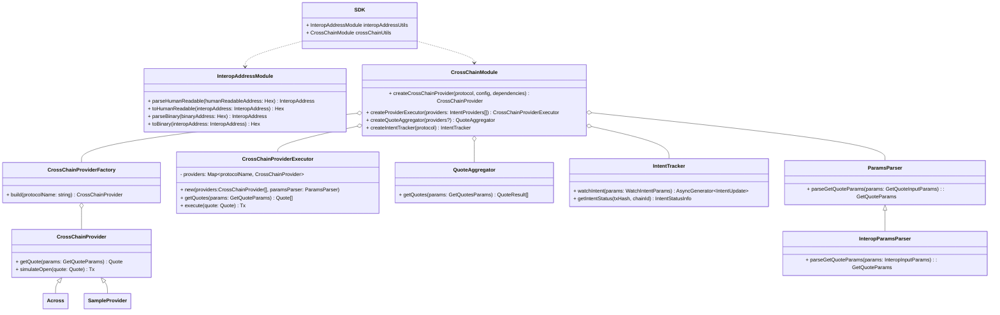

The _Interop SDK_ is a TypeScript library for building cross-chain transactions using interoperable address formats defined in ERC-7828 and ERC-7930. Is designed to power wallets and applications that want to offer seamless, single-click multichain experiences without exposing users to bridges, swap, token selections, or routing complexity.

Natively supports the interoperable address format: \<address\> @ \<chain\> # \<checksum\>

Its provider-based architecture makes it easy to integrate new protocols and chains. By default, the SDK includes support for ERC-7828/7930 address resolution and cross-chain transfers via Across, with more integrations (swaps, privacy, token aggregation) coming soon.

Interop introduces a clean separation of concerns between **intent resolution** and **protocol execution**, making it easy to build wallets or apps that support seamless, programmable value transfer across multiple networks.

## Currently Status

Testnet:
- ERC-7828/7930 address handling and conversion
- Cross-chain transfers via Across Protocol
- Intent tracking (EIP-7683 integration)
- Multi-provider quote aggregation
- ENS name resolution for addresses

In Development:
- Full [OIF](https://efdn.notion.site/The-Open-Intents-Framework-permissionless-cross-chain-interop-to-all-chains-29cd9895554181e2966fe6585980ca9b) integration
- ENS on-chain chain registry (currently using off-chain registries)
- Additional protocols

## Core Modules

### `addresses`

The `addresses` module provides tools to work with **interoperable addresses**—a format designed to encode a recipient, a chain, and optionally a domain name (e.g., `alice.eth@arb1`).

It includes utilities to:

-   Parse human-readable interoperable addresses
-   Convert to and from [ERC-7930](https://ethereum-magicians.org/t/erc-7930-interoperable-addresses/23365)-compatible address formats
-   Resolve ENS names to target addresses on supported chains
-   Validate checksums and shortnames

This module standardizes how applications handle multi-chain addressing and ensures compatibility across chains and identity systems.

### `cross-chain`

The `cross-chain` module is responsible for managing the **intent workflow**: from user input to executable transfer strategies.

It includes logic to:

-   Parse and validate user-defined transfer intents (e.g., "Send 100 USDC to `bob.eth@oeth`")
-   Fetch quotes from cross-chain providers
-   Simulate gas, slippage, execution costs, and fallback routes
-   Track intent status from initiation to completion
-   Aggregate and compare quotes from multiple providers

This module acts as a routing engine and aggregator, designed to support declarative preferences while keeping users in control of execution.

## Intent-Centric Architecture

Interop moves away from protocol-first flows and embraces an **intent-first model**. Instead of exposing low-level swap/bridge UIs, apps powered by the SDK can surface high-level actions like:

> _“Send 100 USDC to `alice.eth@arb1`”_

The SDK provides building blocks for:
-   Fetching quotes from cross-chain providers
-   Comparing quotes across multiple protocols
-   Executing cross-chain transfers
-   Tracking intent status from initiation to completion
-   Handling errors and timeouts gracefully

This reduces surface area for user error, increases composability, and makes the experience smoother for both devs and users.

## Wallets and Apps Integration

The Interop SDK is designed to be embedded into:

-   Wallets that want to offer native cross-chain transfers
-   Payment UIs or checkout flows with multi-chain support
-   Cross-chain bots, agents, or automation systems
-   Any app that wants to offer seamless value movement

Developers remain in control of what chains, protocols, and assets to support through configuration and whitelisting.
