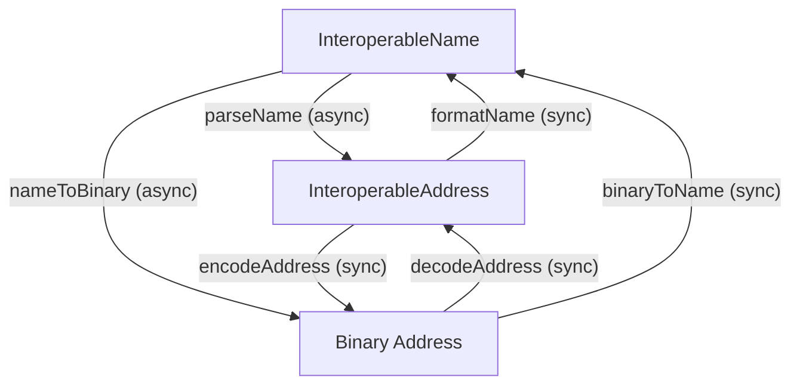

This page explains the ideas behind the `addresses` package — the standards it implements, the architecture it follows, and the design decisions that shape its API.

## The problem

Blockchain addresses today are chain-specific. An Ethereum address like `0xd8dA6BF26964aF9D7eEd9e03E53415D37aA96045` doesn't tell you _which_ chain the account lives on. In a multichain world, this ambiguity leads to lost funds, broken UIs, and manual chain selection.

Interoperable addresses solve this by encoding the chain alongside the address in a single, standardized format.

## The standards

The package implements three complementary standards:

### EIP-7930: Interoperable Addresses

Defines a **binary serialization format** for addresses that includes a version byte, chain type, chain reference, and the address itself. This is the canonical wire format — compact, unambiguous, and suitable for storage and transmission.

Example (hex): `0x00010000010114d8da6bf26964af9d7eed9e03e53415d37aa96045`

### CAIP-350: Text Encoding Rules

Defines how the binary fields should be represented as human-readable text, with chain-type-specific rules:

-   **eip155**: Chain references as decimal strings, addresses as hex with EIP-55 checksumming
-   **bip122**: Chain references as 32-char lowercase hex (genesis hash prefix), addresses as base58check or bech32/bech32m
-   **solana**: Base58 encoding for both chain references and addresses

### ERC-7828: Readable Interoperable Names

Defines a **human-readable string format** that combines an address (or ENS name), a chain identifier, and an optional checksum:

```
vitalik.eth@eip155:1#4CA88C9C
```

Format: `{address}@{chainType}:{chainReference}#{checksum}`

This format supports ENS names and chain shortnames (like `eth` or `base`) for better UX.

## Two-layer architecture

The package is organized into two layers, each handling a different level of abstraction:

### Address Layer (sync)

Handles the structured `InteroperableAddress` type — a discriminated union that can be either a **text** or **binary** representation:

```typescript
// Text variant — human-friendly strings
{ version: 1, chainType: "eip155", chainReference: "1", address: "0xd8dA..." }

// Binary variant — raw bytes
{ version: 1, chainType: Uint8Array, chainReference: Uint8Array, address: Uint8Array }
```

All Address Layer operations are **synchronous**: encoding, decoding, checksum calculation, validation, and conversion between representations. Use `isTextAddress()` or `isBinaryAddress()` type guards to narrow the union.

### Name Layer (async)

Handles the human-readable `InteroperableName` string format. Operations in this layer are **asynchronous** because they may need to:

-   Resolve ENS names to raw addresses (via ENSIP-11)
-   Resolve chain shortnames (like `eth`) to CAIP-2 identifiers (like `eip155:1`)

The Name Layer builds on top of the Address Layer — parsing a name ultimately produces an `InteroperableAddress`.

### How the layers connect



## Chain resolution

When a name uses a chain shortname (e.g., `@eth` instead of `@eip155:1`), the SDK resolves it using a two-tier strategy:

1. **Onchain**: Queries the `on.eth` ENS registry on Ethereum mainnet. The registry maps labels like `ethereum` to their ERC-7930 binary representation.
2. **Offchain fallback**: Uses the chainid.network registry to map shortnames to chain IDs.

Both are enabled by default. Fully-qualified CAIP-2 identifiers (e.g., `eip155:10`) skip resolution entirely.

You can customize resolution behavior per call:

```typescript
// Disable onchain, use offchain only
await parseName("0x...@eth", { onchainRegistry: false });

// Custom registry domain
await parseName("0x...@eth", { onchainRegistry: "custom.eth" });

// Custom RPC URL for onchain resolution
await parseName("0x...@eth", { rpcUrl: "https://my-rpc.example.com" });
```

## Checksums

Checksums protect against typos and address tampering. The checksum is computed from the binary serialization of the address and appended to the name after a `#`:

```
vitalik.eth@eip155:1#4CA88C9C
                     ^^^^^^^^ checksum
```

The SDK always calculates the checksum when parsing. If the input includes a checksum, the SDK compares it against the calculated value and reports any mismatch via `result.meta.checksumMismatch`.

## References

-   [EIP-7930: Interoperable Addresses](https://eips.ethereum.org/EIPS/eip-7930)
-   [ERC-7828: Readable Interoperable Addresses using ENS](https://eips.ethereum.org/EIPS/eip-7828)
-   [CAIP-350: Interoperable Addresses](https://github.com/ChainAgnostic/CAIPs/blob/master/CAIPs/caip-350.md)
