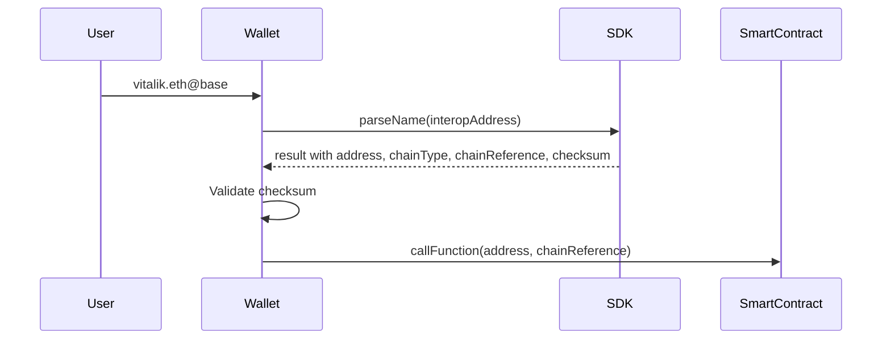

# Parsing an Interoperable Name

In this guide, you'll learn how to extract the raw address and chain ID from an interop address using the Interop SDK. This is especially useful for developers building wallets or dApps that need to interact with smart contracts not yet supporting interop addresses natively.

## Motivation

While interop addresses provide a convenient, human-readable way to represent accounts across multiple chains, most smart contracts today expect canonical addresses and chain IDs. To ensure compatibility, it's important to be able to parse an interop address into its underlying components.

## Use Case

Suppose you're a wallet developer. You want your users to be able to input an interop address (e.g., `vitalik.eth@base#4CA88C9C`) and seamlessly interact with contracts that only accept canonical addresses. The SDK makes this process straightforward.

Since you're building a wallet and want your product to be as fast and lightweight as possible, it's best to import only the individual functions you need. This approach maximizes tree shaking and minimizes your bundle size.

### Example Workflow



## Parsing with Full Metadata

The `parseName` method is the recommended way to extract all components from an interoperable address. It returns the address, chain ID, checksum, and metadata in a single call.

```typescript
import { parseName } from "@wonderland/interop-addresses";

const interoperableName = "vitalik.eth@base#4CA88C9C";
const result = await parseName(interoperableName);

console.log(result.text.address); // "0xd8dA6BF26964aF9D7eEd9e03E53415D37aA96045"
console.log(result.text.chainReference); // "8453" (Base chain ID)
console.log(result.meta.checksum); // "4CA88C9C"
console.log(result.meta.isENS); // true
```

-   The function resolves ENS names according to [ENSIP-11](https://docs.ens.domains/ensip/11).
-   It resolves chain shortnames (like `base`) to their chain IDs.
-   The checksum is always calculated and available in `result.meta.checksum`.

## Validating the Checksum

Before using the parsed address, you should validate the checksum to ensure the address hasn't been tampered with:

```typescript
import { parseName, validateChecksum } from "@wonderland/interop-addresses";

const interoperableName = "vitalik.eth@base#4CA88C9C";
const result = await parseName(interoperableName);

// Check if there was a checksum mismatch
if (result.meta.checksumMismatch) {
    console.warn("Checksum mismatch detected!");
    console.warn(`Provided: ${result.meta.checksumMismatch.provided}`);
    console.warn(`Calculated: ${result.meta.checksumMismatch.calculated}`);
    // Handle the mismatch appropriately for your use case
}

// Or explicitly validate the checksum
try {
    validateChecksum(result.address, result.meta.checksum, {
        isENSName: result.meta.isENS,
    });
    console.log("Checksum is valid!");
} catch (error) {
    console.error("Invalid checksum:", error);
}
```

## Alternative: Using Individual Functions

If you only need specific components, you can use the individual extraction functions:

```typescript
import { getAddress, getChainId } from "@wonderland/interop-addresses";

const interoperableName = "vitalik.eth@base#4CA88C9C";

// Extract just the address
const address = await getAddress(interoperableName);
console.log(address); // "0xd8dA6BF26964aF9D7eEd9e03E53415D37aA96045"

// Extract just the chain ID
const chainId = await getChainId(interoperableName);
console.log(chainId); // "8453"
```

## Working with Binary Addresses

If you already have a binary address, you can extract components synchronously:

```typescript
import { binaryToAddressText } from "@wonderland/interop-addresses";

const binaryAddress = "0x00010000010114d8da6bf26964af9d7eed9e03e53415d37aa96045";

// Convert to structured object with CAIP-350 text-encoded fields (synchronous)
const text = binaryToAddressText(binaryAddress);
console.log(text);
// {
//   version: 1,
//   chainType: "eip155",
//   chainReference: "1",  // Decimal string per CAIP-350
//   address: "0xd8dA6BF26964aF9D7eEd9e03E53415D37aA96045"  // Hex with EIP-55 checksum per CAIP-350
// }
```

## Complete Example

Here's a complete example showing the recommended workflow:

```typescript
import { parseName, validateChecksum } from "@wonderland/interop-addresses";

async function processInteropAddress(interopAddress: string) {
    try {
        // Parse the address
        const result = await parseName(interopAddress);

        // Validate checksum
        if (result.meta.checksumMismatch) {
            throw new Error("Checksum mismatch - address may have been tampered with");
        }

        // Use the extracted components
        const address = result.text.address!;
        const chainId = result.text.chainReference!;

        // Now you can use these with your smart contract
        console.log(`Address: ${address}`);
        console.log(`Chain ID: ${chainId}`);
        console.log(`Is ENS: ${result.meta.isENS}`);

        return { address, chainId };
    } catch (error) {
        console.error("Failed to parse interop address:", error);
        throw error;
    }
}

// Usage
await processInteropAddress("vitalik.eth@base#4CA88C9C");
```

## Additional Notes

-   **Error Handling:** `parseName` will throw errors if the input is invalid or the chain reference is not supported. Always wrap calls in try/catch blocks for production use.
-   **ENS Resolution:** The ENS resolution is performed following [ENSIP-11](https://docs.ens.domains/ensip/11), ensuring compatibility with the latest ENS standards.
-   **Checksum Validation:** Always validate checksums before using addresses in production to prevent tampering.
-   **Chain Shortnames:** The SDK resolves chain shortnames (like `base`, `eth`) to their numeric chain IDs automatically.
