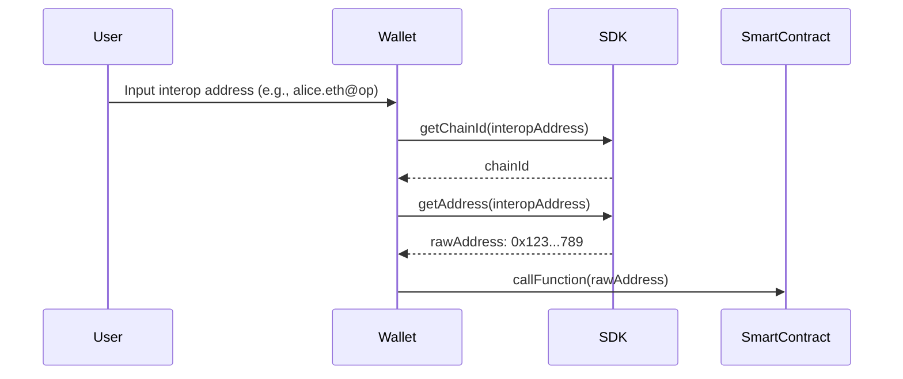

# Parsing an Interop Address

In this guide, you'll learn how to extract the raw address and chain ID from an interop address using the Interop SDK. This is especially useful for developers building wallets or dApps that need to interact with smart contracts not yet supporting interop addresses natively.

## Motivation

While interop addresses provide a convenient, human-readable way to represent accounts across multiple chains, most smart contracts today expect canonical addresses and chain IDs. To ensure compatibility, it's important to be able to parse an interop address into its underlying components.

## Use Case

Suppose you're a wallet developer. You want your users to be able to input an interop address (e.g., `alice.eth@op`) and seamlessly interact with contracts that only accept canonical addresses. The SDK makes this process straightforward.

Since you're building a wallet and want your product to be as fast and lightweight as possible, it's best to import only the individual functions you need. This approach maximizes tree shaking and minimizes your bundle size.

### Example Workflow



## Extracting the Chain ID

The `getChainId` method allows you to extract the chain ID from a human-readable interop address. This is useful for routing transactions to the correct network.

```js
import { getChainId } from "@wonderland/interop";

const humanReadableAddress = "alice.eth@op";
const chainId = await getChainId(humanReadableAddress);

console.log(chainId); // 10
```

-   The chain ID is determined by the suffix after the `@` symbol (e.g., `@op` for Optimism, which has chain ID 10).
-   For details on supported chains, see [ERC-7828](https://ethereum-magicians.org/t/erc-7828-chain-specific-addresses-using-ens/21930).
-   If the suffix is unrecognized, the function will throw an error.

## Extracting the Raw Address

The `getAddress` method returns the canonical address corresponding to the interop address. This is the address you would use in contract calls.

```js
import { getAddress } from "@wonderland/interop";

const humanReadableAddress = "alice.eth@op";
const address = await getAddress(humanReadableAddress);

console.log(address); // 0x123...789
```

-   If the address is an ENS name, the SDK will resolve it according to [ENSIP-11](https://docs.ens.domains/ensip/11).
-   If the address is already in hexadecimal format, it will be returned as-is.
-   The function automatically handles ENS resolution and chain-specific address formats.

## Additional Notes

-   **Error Handling:** Both `getChainId` and `getAddress` will throw errors if the input is invalid or the chain suffix is not supported. Always wrap calls in try/catch blocks for production use.
-   **ENS Resolution:** The ENS resolution is performed following [ENSIP-11](https://docs.ens.domains/ensip/11), ensuring compatibility with the latest ENS standards.
