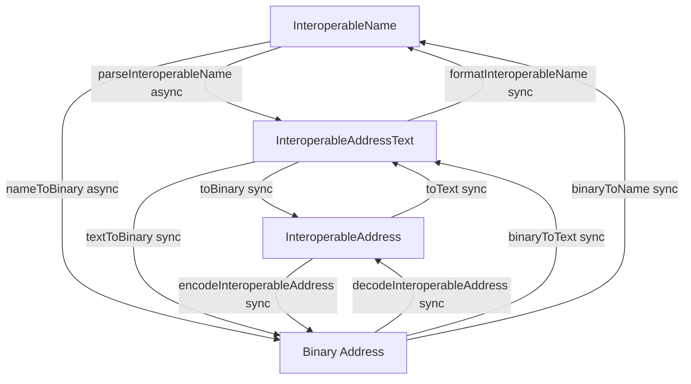

The `addresses` package provides a robust solution for handling interoperable blockchain addresses across different networks, following the [EIP-7930](https://eips.ethereum.org/EIPS/eip-7930) and [ERC-7828](https://eips.ethereum.org/EIPS/eip-7828) standards. This guide will help you get started with using the package in your projects.

## Installing the Package

```bash
npm install @wonderland/interop-addresses
# or
yarn add @wonderland/interop-addresses
# or
pnpm add @wonderland/interop-addresses
```

## Architecture Overview

The package follows a clean three-layer architecture:

1. **Binary Layer (EIP-7930)**: Pure binary encoding/decoding - synchronous, no dependencies
2. **Text Layer (CAIP-350)**: Structured text representation - synchronous conversion
3. **Name Layer (ERC-7828)**: Human-readable names with ENS resolution - async operations

## Basic Usage

The package provides high-level convenience methods and direct layer functions:

### High-Level Convenience Methods

```typescript
import {
    binaryToName,
    binaryToText,
    nameToBinary,
    textToBinary,
} from "@wonderland/interop-addresses";

// Convert an interoperable name to binary (async - may resolve ENS)
const name = "vitalik.eth@eip155:1#4CA88C9C";
const binaryAddress = await nameToBinary(name, { format: "hex" });

// Convert binary to name (synchronous)
const nameFromBinary = binaryToName("0x00010000010114d8da6bf26964af9d7eed9e03e53415D37aa96045");

// Convert structured text to binary (synchronous)
const text = {
    version: 1,
    chainType: "eip155",
    chainReference: "1",
    address: "0xd8dA6BF26964aF9D7eEd9e03E53415D37aA96045",
};
const binaryFromText = textToBinary(text, { format: "hex" });

// Convert binary to structured text (synchronous)
const textFromBinary = binaryToText("0x00010000010114d8da6bf26964af9d7eed9e03e53415D37aa96045");
```

### Extracting Components

```typescript
import { getAddress, getChainId } from "@wonderland/interop-addresses";

// Extract address from binary or name
const address = await getAddress("vitalik.eth@eip155:1#4CA88C9C");
// Returns: "0xd8dA6BF26964aF9D7eEd9e03E53415D37aA96045"

// Extract chain ID from binary or name
const chainId = await getChainId("vitalik.eth@eip155:1#4CA88C9C");
// Returns: "1"
```

## Address Formats

The package supports four main address representations:

1. **Interoperable Name (ERC-7828)**: Human-readable string format

    - Format: `{address}@{chainType}:{chainReference}#{checksum}`
    - Example: `vitalik.eth@eip155:1#4CA88C9C`
    - Supports ENS names and chain labels
    - Requires async operations for resolution

2. **InteroperableAddressText (CAIP-350)**: Structured object with string fields

    ```typescript
    {
      version: 1,
      chainType: "eip155",
      chainReference: "1",
      address: "0xd8dA6BF26964aF9D7eEd9e03E53415D37aA96045"
    }
    ```

    - Synchronous conversions
    - No resolution needed
    - Used by the Text layer

3. **InteroperableAddress (EIP-7930)**: Structured object with binary fields

    ```typescript
    {
      version: 1,
      chainType: Uint8Array,      // 2 bytes
      chainReference: Uint8Array,  // Variable length
      address: Uint8Array          // Variable length
    }
    ```

    - Canonical binary object representation
    - Used by the Binary layer
    - Synchronous operations

4. **Binary Address (Serialized)**: Hex or bytes string representation
    - Example: `0x00010000010114d8da6bf26964af9d7eed9e03e53415D37aa96045`
    - Serialized form of InteroperableAddress
    - Used for storage and transmission
    - Synchronous operations



## Working with Different Layers

### Name Layer (Async)

Use when you need ENS resolution or chain label resolution:

```typescript
import { nameToBinary, parseInteroperableName } from "@wonderland/interop-addresses";

// Parse with full metadata
const result = await parseInteroperableName("vitalik.eth@eip155:1#4CA88C9C");
// result.name - original parsed components
// result.text - CAIP-350 text representation
// result.address - binary address
// result.meta.checksum - calculated checksum
// result.meta.isENS - whether address was ENS
// result.meta.isChainLabel - whether chain reference was a label

// Simple conversion
const binary = await nameToBinary("vitalik.eth@eip155:1#4CA88C9C", { format: "hex" });
```

### Text Layer (Synchronous)

Use when you already have structured data and don't need resolution:

```typescript
import { binaryToText, textToBinary, toBinary, toText } from "@wonderland/interop-addresses";

// Convert text to binary
const text = {
    version: 1,
    chainType: "eip155",
    chainReference: "1",
    address: "0xd8dA6BF26964aF9D7eEd9e03E53415D37aA96045",
};
const binary = textToBinary(text, { format: "hex" });

// Convert binary to text
const textFromBinary = binaryToText("0x00010000010114d8da6bf26964af9d7eed9e03e53415D37aa96045");
```

### Binary Layer (Synchronous)

Use for direct binary operations:

```typescript
import {
    calculateChecksum,
    decodeInteroperableAddress,
    encodeInteroperableAddress,
} from "@wonderland/interop-addresses";

// Decode binary
const addr = decodeInteroperableAddress("0x00010000010114d8da6bf26964af9d7eed9e03e53415D37aa96045");

// Encode to binary
const hex = encodeInteroperableAddress(addr, { format: "hex" });

// Calculate checksum
const checksum = calculateChecksum(addr);
```

## Chain Resolution

The package resolves chain identifiers using off-chain registries:

-   **Primary**: Uses `shortnameToChainId` with built-in chain shortname mappings
-   **Fallback**: Uses viem's chain definitions and chainid.network

> We're currently working on the ENS on-chain chain registry, though it hasn't been deployed yet.
> For now, the SDK uses off-chain registries (such as chainid.network and viem) as the main resolution mechanism.

## References

-   [EIP-7930: Interoperable Addresses](https://eips.ethereum.org/EIPS/eip-7930)
-   [ERC-7828: Readable Interoperable Addresses using ENS](https://eips.ethereum.org/EIPS/eip-7828)
-   [CAIP-350: Interoperable Addresses](https://github.com/ChainAgnostic/CAIPs/blob/master/CAIPs/caip-350.md)
