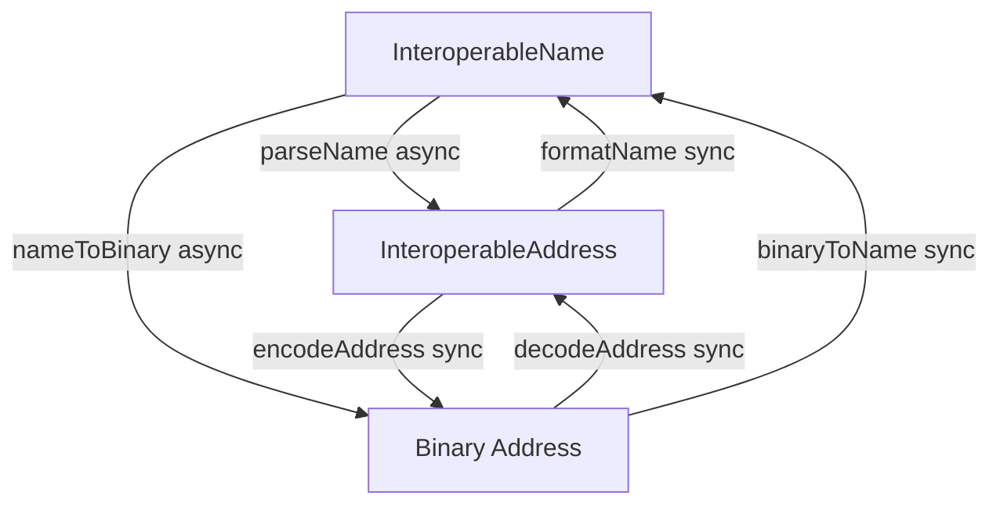

The `addresses` package provides a robust solution for handling interoperable blockchain addresses across different networks, following the [EIP-7930](https://eips.ethereum.org/EIPS/eip-7930) and [ERC-7828](https://eips.ethereum.org/EIPS/eip-7828) standards. This guide will help you get started with using the package in your projects.

## Installing the Package

```bash
npm install @wonderland/interop-addresses
# or
yarn add @wonderland/interop-addresses
# or
pnpm add @wonderland/interop-addresses
```

## Architecture Overview

The package follows a clean two-layer architecture:

1. **Address Layer (EIP-7930 + CAIP-350)**: Discriminated union address representation (binary or text) - synchronous encoding/decoding with automatic conversion
2. **Name Layer (ERC-7828)**: Human-readable names with ENS resolution - async operations

## Basic Usage

The package provides high-level convenience methods and direct layer functions:

### High-Level Convenience Methods

```typescript
import {
    binaryToName,
    decodeAddress,
    encodeAddress,
    nameToBinary,
} from "@wonderland/interop-addresses";

// Convert an interoperable name to binary (async - may resolve ENS)
const name = "vitalik.eth@eip155:1#4CA88C9C";
const binaryAddress = await nameToBinary(name, { format: "hex" });

// Convert binary to name (synchronous)
const nameFromBinary = binaryToName("0x00010000010114d8da6bf26964af9d7eed9e03e53415D37aa96045");

// Convert text representation to binary (synchronous)
const textAddr = {
    version: 1,
    chainType: "eip155",
    chainReference: "1",
    address: "0xd8dA6BF26964aF9D7eEd9e03E53415D37aA96045",
};
const binaryFromText = encodeAddress(textAddr, { format: "hex" });

// Convert binary to text representation (synchronous)
const textFromBinary = decodeAddress("0x00010000010114d8da6bf26964af9d7eed9e03e53415D37aa96045", {
    representation: "text",
});
```

### Extracting Components

```typescript
import { getAddress, getChainId } from "@wonderland/interop-addresses";

// Extract address from binary or name
const address = await getAddress("vitalik.eth@eip155:1#4CA88C9C");
// Returns: "0xd8dA6BF26964aF9D7eEd9e03E53415D37aA96045"

// Extract chain ID from binary or name
const chainId = await getChainId("vitalik.eth@eip155:1#4CA88C9C");
// Returns: "1"
```

## Address Formats

The package supports three main address representations:

1. **Interoperable Name (ERC-7828)**: Human-readable string format

    - Format: `{address}@{chainType}:{chainReference}#{checksum}`
    - Example: `vitalik.eth@eip155:1#4CA88C9C`
    - Supports ENS names and chain labels
    - Requires async operations for resolution

2. **InteroperableAddress (EIP-7930 + CAIP-350)**: Discriminated union - either binary or text representation

    **Text Variant:**

    ```typescript
    {
      version: 1,
      chainType: "eip155",  // String literal
      chainReference: "1",   // String (CAIP-350 encoded)
      address: "0xd8dA6BF26964aF9D7eEd9e03E53415D37aA96045"  // String (CAIP-350 encoded)
    }
    ```

    **Binary Variant:**

    ```typescript
    {
      version: 1,
      chainType: Uint8Array,  // 2 bytes
      chainReference?: Uint8Array,  // Variable length
      address?: Uint8Array  // Variable length
    }
    ```

    - TypeScript narrows based on `chainType` field type (string vs Uint8Array)
    - Use type guards: `isTextAddress()` or `isBinaryAddress()`
    - Functions automatically convert between representations as needed
    - Default representation is "text" (more user-friendly)
    - Fields use CAIP-350 text encoding rules when in text variant:
        - **eip155**: Decimal strings for chain references, hex with EIP-55 checksumming for addresses
        - **solana**: Base58 encoding for both chain references and addresses

3. **Binary Address (Serialized)**: Hex or bytes string representation
    - Example: `0x00010000010114d8da6bf26964af9d7eed9e03e53415D37aa96045`
    - Serialized form of InteroperableAddress
    - Used for storage and transmission
    - Synchronous operations



## Working with Different Layers

### Name Layer (Async)

Use when you need ENS resolution or chain label resolution:

```typescript
import { nameToBinary, parseName } from "@wonderland/interop-addresses";

// Parse with full metadata (defaults to text representation)
const result = await parseName("vitalik.eth@eip155:1#4CA88C9C");
// result.name - original parsed components
// result.address - address in text representation (default)
//   - result.address.chainType - "eip155" (string)
//   - result.address.chainReference - "1" (string)
//   - result.address.address - "0xd8dA6BF26964aF9D7eEd9e03E53415D37aA96045" (string)
// result.meta.checksum - calculated checksum
// result.meta.isENS - whether address was ENS
// result.meta.isChainLabel - whether chain reference was a label

// Parse to binary representation
const resultBinary = await parseName("vitalik.eth@eip155:1#4CA88C9C", { representation: "binary" });
// resultBinary.address.chainType - Uint8Array
// resultBinary.address.chainReference - Uint8Array
// resultBinary.address.address - Uint8Array

// Simple conversion
const binary = await nameToBinary("vitalik.eth@eip155:1#4CA88C9C", { format: "hex" });
```

### Address Layer (Synchronous)

Use for direct address operations with unified binary and text representations:

```typescript
import {
    calculateChecksum,
    decodeAddress,
    encodeAddress,
    isTextAddress,
    toBinaryRepresentation,
    toTextRepresentation,
} from "@wonderland/interop-addresses";

// Decode binary to text representation (default)
const textAddr = decodeAddress("0x00010000010114d8da6bf26964af9d7eed9e03e53415D37aa96045");
// textAddr.chainType - "eip155" (string)
// textAddr.chainReference - "1" (string)
// textAddr.address - "0xd8dA6BF26964aF9D7eEd9e03E53415D37aA96045" (string)

// Decode binary to binary representation
const binaryAddr = decodeAddress("0x00010000010114d8da6bf26964af9d7eed9e03e53415D37aa96045", {
    representation: "binary",
});
// binaryAddr.chainType - Uint8Array
// binaryAddr.chainReference - Uint8Array
// binaryAddr.address - Uint8Array

// Use type guards to narrow the type
if (isTextAddress(textAddr)) {
    console.log(textAddr.chainType); // TypeScript knows this is a string
}

// Convert between representations
const textToBinary = toBinaryRepresentation(textAddr);
const binaryToText = toTextRepresentation(binaryAddr);

// Encode address to binary (accepts either representation, converts automatically)
const textAddr2 = {
    version: 1,
    chainType: "eip155",
    chainReference: "1",
    address: "0xd8dA6BF26964aF9D7eEd9e03E53415D37aA96045",
};
const hex = encodeAddress(textAddr2, { format: "hex" }); // Automatically converts text to binary

// Calculate checksum (accepts either representation)
const checksum = calculateChecksum(textAddr);
```

## Chain Resolution

The package resolves chain identifiers using off-chain registries:

-   **Primary**: Uses `shortnameToChainId` with built-in chain shortname mappings
-   **Fallback**: Uses viem's chain definitions and chainid.network

> We're currently working on the ENS on-chain chain registry, though it hasn't been deployed yet.
> For now, the SDK uses off-chain registries (such as chainid.network and viem) as the main resolution mechanism.

## References

-   [EIP-7930: Interoperable Addresses](https://eips.ethereum.org/EIPS/eip-7930)
-   [ERC-7828: Readable Interoperable Addresses using ENS](https://eips.ethereum.org/EIPS/eip-7828)
-   [CAIP-350: Interoperable Addresses](https://github.com/ChainAgnostic/CAIPs/blob/master/CAIPs/caip-350.md)
