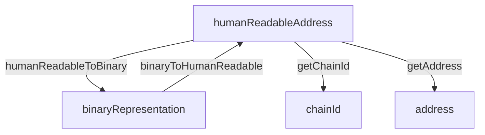

The `addresses` package provides a robust solution for handling interoperable blockchain addresses across different networks, following the [ERC-7930](https://ethereum-magicians.org/t/erc-7930-interoperable-addresses/23365) standard. This guide will help you get started with using the package in your projects.

## Installing the Package

```bash
npm install @defi-wonderland/interop-addresses
# or
yarn add @defi-wonderland/interop-addresses
# or
pnpm add @defi-wonderland/interop-addresses
```

## Basic Usage

The package provides two main ways to work with addresses:

1. Using the `InteropAddressProvider` class
2. Using individual utility functions

### Using InteropAddressProvider

```typescript
import { InteropAddressProvider } from "@defi-wonderland/interop";

// Convert a human-readable address to binary format
const humanReadableAddress = "alice.eth@eip155:1#ABCD1234";
const binaryAddress = await InteropAddressProvider.humanReadableToBinary(humanReadableAddress);

// Convert a binary address back to human-readable format
const humanReadable = await InteropAddressProvider.binaryToHumanReadable(binaryAddress);

// Extract chain ID from a binary address
const chainId = await InteropAddressProvider.getChainId(binaryAddress);

// Extract the address component from a binary address
const address = await InteropAddressProvider.getAddress(binaryAddress);
```

### Using Individual Functions

For better tree-shaking and modularity, you can import individual functions:

```typescript
import {
    binaryToHumanReadable,
    getAddress,
    getChainId,
    humanReadableToBinary,
} from "@defi-wonderland/interop-addresses";

const humanReadableAddress = "alice.eth@eip155:1#ABCD1234";
const binaryAddress = await humanReadableToBinary(humanReadableAddress);
```

## Address Format

The package supports two main address formats:

1. **Human-Readable Format**: `{address}@{chainType}:{chainReference}#{checksum}`
   Example: `alice.eth@eip155:1#ABCD1234`
2. **Binary Format**: ERC-7930 compliant representation of the address

The package provides methods for converting a human-readable address to its binary representation and vice versa.


## Chain Resolution

The package resolves chain identifiers using off-chain registries:

- **Primary**: Uses `shortnameToChainId` with built-in chain shortname mappings
- **Fallback**: Uses viem's chain definitions and chainid.network


>We’re currently working on the ENS on-chain chain registry, though it hasn’t been deployed yet.
For now, the SDK uses off-chain registries (such as chainid.network and viem) as the main resolution mechanism.


## References

-   [ERC-7930: Interoperable Addresses](https://ethereum-magicians.org/t/erc-7930-interoperable-addresses/23365)
