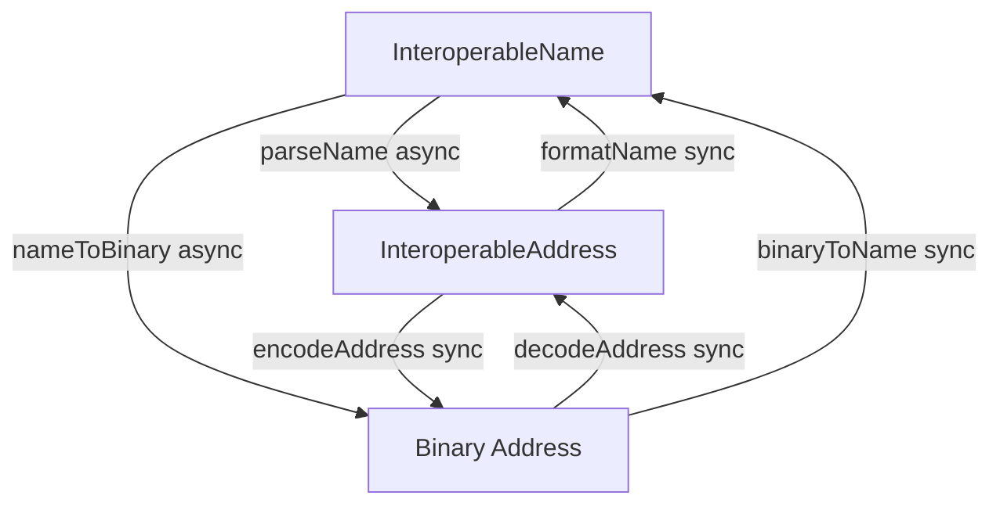

In this tutorial, you'll parse an interoperable address and extract its components. By the end, you'll know how to go from a human-readable name like `vitalik.eth@eip155:1` to its raw address and chain ID.

## Install the package

```bash
npm install @wonderland/interop-addresses
# or
yarn add @wonderland/interop-addresses
# or
pnpm add @wonderland/interop-addresses
```

## Parse an interoperable name

An interoperable name encodes an address, a chain, and a checksum in a single string. Let's parse one:

```typescript
import { isTextAddress, parseName } from "@wonderland/interop-addresses";

const result = await parseName("vitalik.eth@eip155:1");

if (isTextAddress(result.interoperableAddress)) {
    console.log(result.interoperableAddress.address);
    // "0xd8dA6BF26964aF9D7eEd9e03E53415D37aA96045"

    console.log(result.interoperableAddress.chainReference);
    // "1" (Ethereum mainnet)

    console.log(result.interoperableAddress.chainType);
    // "eip155"
}

console.log(result.meta.isENS); // true — "vitalik.eth" was resolved via ENS
```

`parseName` resolves ENS names, resolves chain labels, and calculates the checksum — all in one call.

## Validate the checksum

Before using the parsed address, check that the checksum matches:

```typescript
if (result.meta.checksumMismatch) {
    console.warn("Checksum mismatch — address may have been tampered with!");
    console.warn(`Provided: ${result.meta.checksumMismatch.provided}`);
    console.warn(`Calculated: ${result.meta.checksumMismatch.calculated}`);
} else {
    console.log("Checksum valid:", result.meta.checksum); // "4CA88C9C"
}
```

## Extract individual components

If you only need the address or chain ID, use the convenience functions:

```typescript
import { getAddress, getChainId } from "@wonderland/interop-addresses";

const address = await getAddress("vitalik.eth@eip155:1");
// "0xd8dA6BF26964aF9D7eEd9e03E53415D37aA96045"

const chainId = await getChainId("vitalik.eth@eip155:1");
// "1"
```

## Work with binary addresses

If you already have a binary (serialized) address, you can decode it synchronously — no async needed:

```typescript
import { decodeAddress, isTextAddress } from "@wonderland/interop-addresses";

const addr = decodeAddress("0x00010000010114d8da6bf26964af9d7eed9e03e53415d37aa96045");

if (isTextAddress(addr)) {
    console.log(addr.chainType); // "eip155"
    console.log(addr.chainReference); // "1"
    console.log(addr.address); // "0xd8dA6BF26964aF9D7eEd9e03E53415D37aA96045"
}
```

## Convert between formats

The SDK supports three formats. Here's how they relate:


```mermaid
graph TD
    A[InteroperableName]
    C[InteroperableAddress]
    D[Binary Address]

    A -->|parseName async| C
    A -->|nameToBinary async| D
    C -->|encodeAddress sync| D
    C -->|formatName sync| A
    D -->|decodeAddress sync| C
    D -->|binaryToName sync| A
```

```typescript
import { binaryToName, nameToBinary } from "@wonderland/interop-addresses";

// Name → Binary (async, may resolve ENS)
const binary = await nameToBinary("vitalik.eth@eip155:1", { format: "hex" });

// Binary → Name (sync)
const name = binaryToName(binary);
```

## Chain resolution {#experimental-onchain-chain-registry}

The SDK resolves chain labels (like `eth` or `base`) to their CAIP-2 identifiers automatically:

```typescript
const result = await parseName("0xd8dA6BF26964aF9D7eEd9e03E53415D37aA96045@eth");
// result.interoperableAddress.chainType === "eip155"
// result.interoperableAddress.chainReference === "1"
```

Resolution uses a two-tier strategy:

1. **Onchain**: Queries the `on.eth` ENS registry on mainnet
2. **Offchain fallback**: Uses chainid.network mappings

Fully-qualified identifiers (e.g., `eip155:10`) always work without any registry lookup.

## Next steps

-   [Concepts](./concepts.md) — understand the two-layer architecture and the standards behind it
-   [Advanced Usage](./advanced-usage.md) — validation, error handling, round-trip conversions, best practices
-   [Parsing an Interoperable Name](./example.md) — a deeper walkthrough for wallet developers
-   [API Reference](./api.md) — complete function signatures and types
