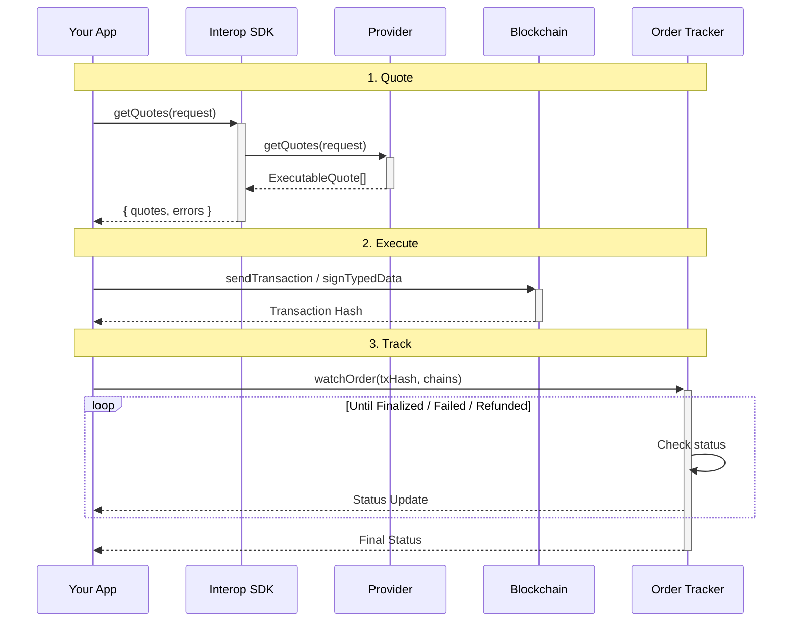

This page explains the ideas behind the `cross-chain` package — the architecture, the standards, and the design decisions that shape how cross-chain transfers work.

## Intent-based architecture

Traditional bridges require users to interact directly with bridge-specific contracts on the origin chain. Each bridge has its own interface, token support, and fee structure, forcing developers to build per-bridge integrations.

The Interop SDK takes an **intent-based** approach instead. The user declares _what_ they want (e.g., "send 100 USDC from Ethereum to Arbitrum"), and the SDK handles _how_ to accomplish it:

1. **Quote**: The SDK asks one or more providers for pricing and execution details
2. **Execute**: The user signs a message or sends a transaction to commit to the transfer
3. **Track**: The SDK monitors the order from initiation to completion

This separation of intent from execution means the same code works across different bridge protocols without provider-specific logic.

## EIP-7683: Cross-Chain Intents

The SDK follows [EIP-7683](https://www.erc7683.org/), which standardizes cross-chain intent structures. EIP-7683 defines:

-   A common order format that any solver or bridge can fill
-   An "open" event on the origin chain that signals the intent is ready to be filled
-   A "fill" event on the destination chain that confirms execution

This standardization is what makes multi-provider aggregation possible — quotes from different providers share a common structure.

## The transfer flow

## Execution modes

Quotes can contain two types of steps, depending on the provider and order type:

### Protocol mode (gasless)

The user signs an EIP-712 typed data message. A solver picks up the signed intent and executes the transfer on the user's behalf. The user pays no gas.

Use `isSignatureOnlyOrder(quote.order)` to detect this mode, and `getSignatureSteps()` to extract the signing payloads.

### User mode (user pays gas)

The user sends a transaction directly to a bridge contract on the origin chain. The user pays gas for the origin-chain transaction.

Use `getTransactionSteps()` to extract the transaction parameters.

## Providers

A provider is an adapter that translates the SDK's standardized `QuoteRequest` into a specific bridge protocol's API. Each provider handles:

-   Fetching quotes from the protocol's API
-   Formatting orders with the correct step types
-   Configuring tracking for that protocol

### Available providers

| Provider                       | Status | Execution Modes                         | Tracking                        |
| ------------------------------ | ------ | --------------------------------------- | ------------------------------- |
| [Across](./across-provider.md) | Active | User (transaction)                      | API (mainnet), Events (testnet) |
| [Relay](./relay-provider.md)   | Active | User (transaction)                      | API-based                       |
| [OIF](./oif-provider.md)       | Active | Protocol + User                         | Event-based                     |
| [Bungee](./bungee-provider.md) | Active | Protocol (permit2) + User (transaction) | API-based                       |

### Choosing a provider

-   **Relay** is a good default — active on mainnet, API-based tracking (no extra RPC URLs needed), automatic transaction notification.
-   **Across** is well-established and active on both mainnet and testnet. Mainnet uses API tracking; testnet requires RPC URLs for event-based tracking.
-   **OIF** offers the most flexibility — supports both gasless (protocol) and user-pays-gas execution modes. Requires access to an OIF-compliant solver endpoint.
-   **Bungee** supports both gasless (permit2 signatures for ERC20) and user-pays-gas (transactions for native ETH). API-based tracking, no extra RPC URLs needed.

## Aggregation and sorting

The `Aggregator` fetches quotes from multiple providers in parallel and returns them sorted by best output amount (highest first). Additional sorting strategies may be added in future releases.

The aggregator also collects errors from individual providers, so you can show partial results even when some providers fail.

## Order tracking

After a transaction is submitted, the SDK can monitor the order through its lifecycle:

**Pending** → **Executing** → **Executed** → **Settling** → **Settled** → **Finalized**

Or: **Failed** / **Refunded**

Tracking works through two mechanisms:

-   **Event-based**: Parse the ERC-7683 open event on the origin chain, then watch for the fill event on the destination chain. Requires RPC URLs for both chains.
-   **API-based**: Poll a provider's status endpoint. Simpler setup, no destination-chain RPC needed.

The tracking mechanism is determined by the provider. See [Order Tracking](./intent-tracking.md) for usage details.

## References

-   [EIP-7683: Cross-Chain Intents](https://www.erc7683.org/)
-   [Open Intents Framework](https://github.com/openintentsframework)
