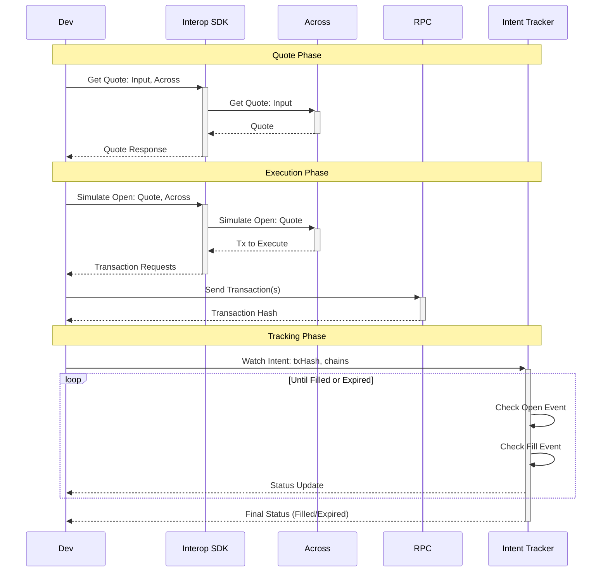

This document provides an overview of the cross-chain transaction flow using the Interop SDK. It illustrates how a developer can interact with different cross-chain protocols, specifically Across, to obtain quotes, simulate transactions, and execute them on-chain. The flow diagram below details the sequence of interactions between the developer, the SDK, the protocol services, and the blockchain RPC endpoint.

## Flow Stages

### 1. Quote Phase

The developer requests a quote from the SDK, which queries the provider protocol for pricing and availability.

### 2. Execution Phase

After reviewing the quote, the developer simulates the transaction to get the exact transaction data, then sends it to the blockchain.

### 3. Tracking Phase

Once the transaction is submitted, the developer can use the Intent Tracker to monitor the cross-chain transfer status in real-time, receiving updates as the intent progresses through its lifecycle (opening → opened → filling → filled/expired).

## Additional Features

The SDK also supports:

-   **Quote Aggregation**: Compare quotes from multiple providers simultaneously
-   **Intent Tracking**: Monitor cross-chain transfers from initiation to completion
-   **Error Handling**: Graceful handling of timeouts and provider errors

See the [Intent Tracking](./intent-tracking.md) and [Quote Aggregator](./quote-aggregator.md) guides for more details.
