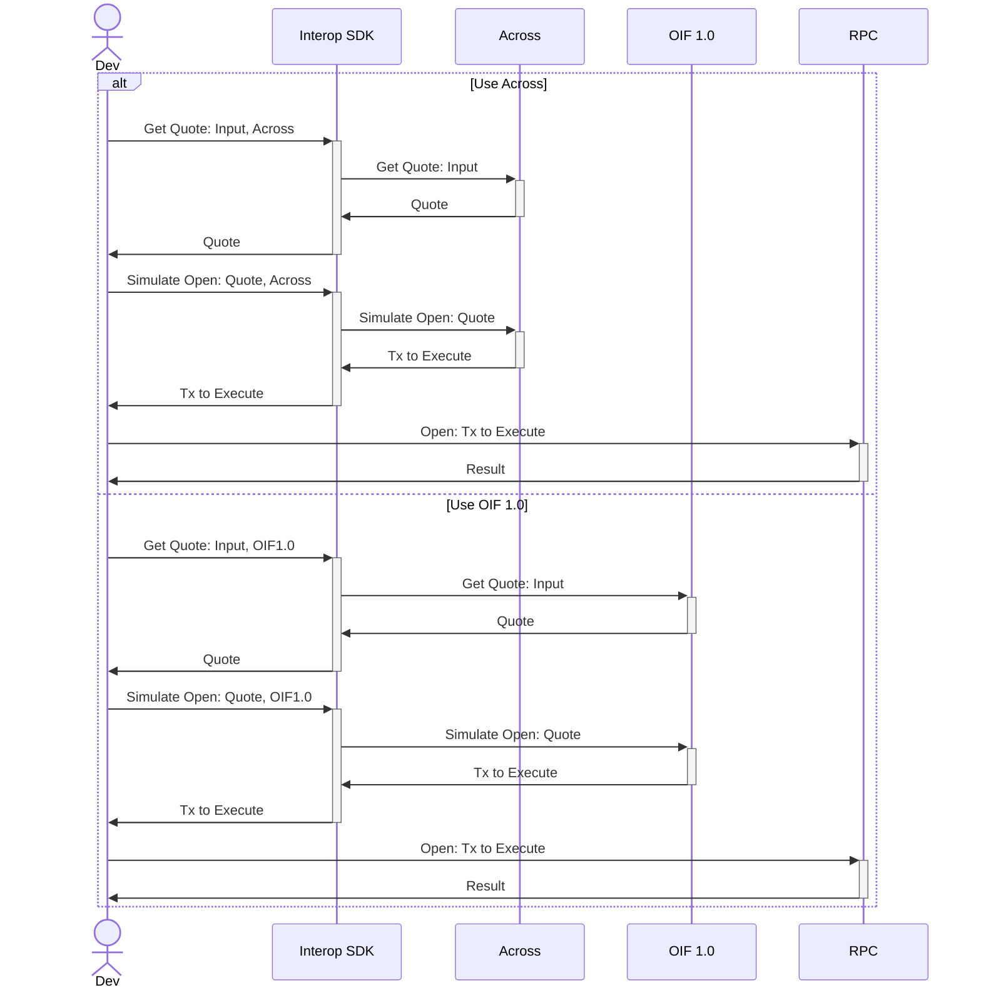

This document provides an overview of the cross-chain transaction flow using the Interop SDK. It illustrates how a developer can interact with different cross-chain protocols, specifically Across and OIF 1.0, to obtain quotes, simulate transactions, and execute them on-chain. The flow diagram below details the sequence of interactions between the developer, the SDK, the protocol services, and the blockchain RPC endpoint.

