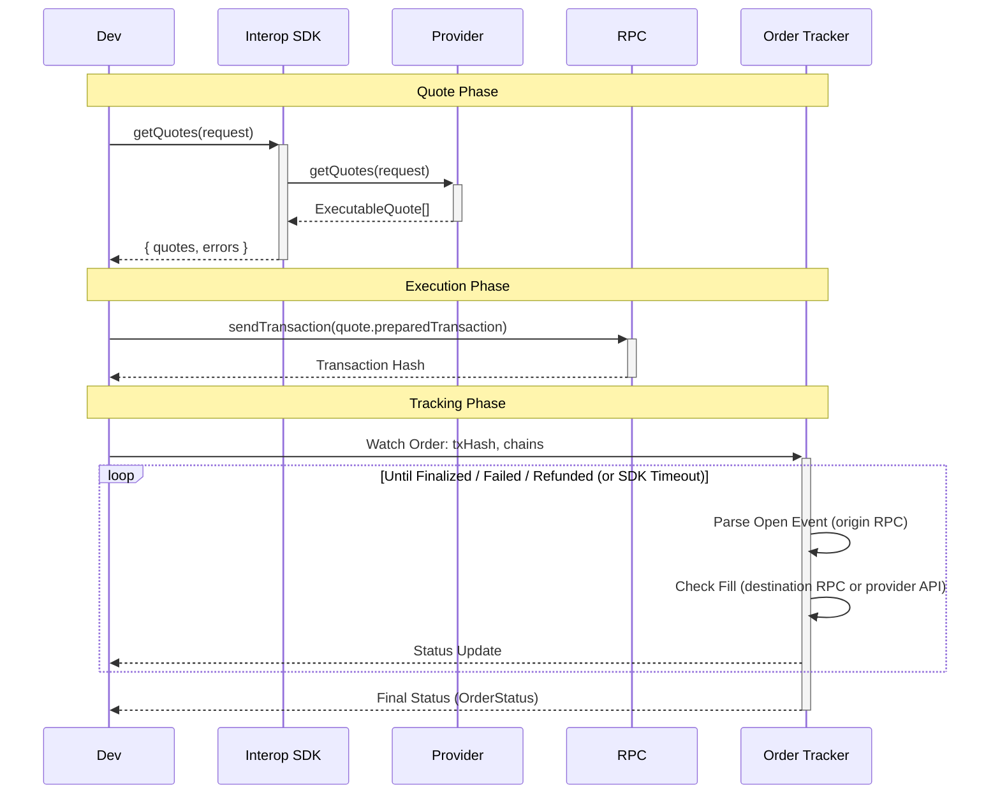

This document provides an overview of the cross-chain transaction flow using the Interop SDK. It illustrates how a developer can interact with different cross-chain protocols to obtain quotes, execute transactions, and track them on-chain.

```mermaid
sequenceDiagram
    participant dev as Dev
    participant sdk as Interop SDK
    participant provider as Provider
    participant rpc as RPC
    participant tracker as Order Tracker

    Note over dev,tracker: Quote Phase
    dev->>+sdk: getQuotes(request)
    sdk->>+provider: getQuotes(request)
    provider-->>-sdk: ExecutableQuote[]
    sdk-->>-dev: { quotes, errors }

    Note over dev,tracker: Execution Phase
    dev->>+rpc: sendTransaction(quote.preparedTransaction)
    rpc-->>-dev: Transaction Hash

    Note over dev,tracker: Tracking Phase
    dev->>+tracker: Watch Order: txHash, chains
    loop Until Finalized / Failed / Refunded (or SDK Timeout)
        tracker->>tracker: Parse Open Event (origin RPC)
        tracker->>tracker: Check Fill (destination RPC or provider API)
        tracker-->>dev: Status Update
    end
    tracker-->>-dev: Final Status (OrderStatus)
```

## Flow Stages

### 1. Quote Phase

The developer requests a quote from the SDK, which queries the provider protocol for pricing and availability.

### 2. Execution Phase

After selecting a quote, the developer sends the prepared transaction to the blockchain.

### 3. Tracking Phase

Once the transaction is submitted, the developer can use the Order Tracker to monitor the cross-chain transfer status in real-time, receiving updates as the order progresses (typically `Pending` → `Finalized`, or `Failed` / `Refunded`).

## Additional Features

The SDK also supports:

-   **Quote Aggregation**: Compare quotes from multiple providers simultaneously
-   **Order Tracking**: Monitor cross-chain transfers from initiation to completion
-   **Error Handling**: Graceful handling of timeouts and provider errors

See the [Order Tracking](./intent-tracking.md) and [Advanced Usage](./advanced-usage.md) guides for more details.
