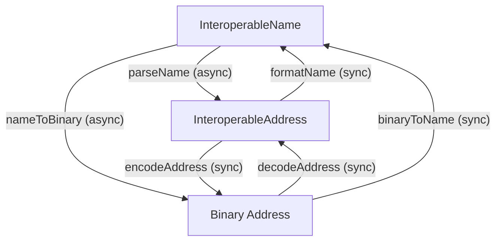

# Concepts

This page explains the standards behind interoperable addresses and how the package implements them.

## The problem

An Ethereum address like `0xd8dA6BF26964aF9D7eEd9e03E53415D37aA96045` doesn't say _which chain_ the account is on. In a multichain world, this ambiguity leads to lost funds, broken UIs, and manual chain selection.

Interoperable addresses solve this by encoding the **chain alongside the address** in a single, standardized format — in two complementary ways.

## Human-readable: ERC-7828

[ERC-7828](https://eips.ethereum.org/EIPS/eip-7828) defines a readable name format designed for end-users, wallets, and UIs:

```
vitalik.eth@ethereum
0xd8dA6BF26964aF9D7eEd9e03E53415D37aA96045@eip155:10#1A2B3C4D
```

The format is: `{address}@{chain}#{checksum}`

What makes it user-friendly:

-   **ENS names** work directly — `vitalik.eth` instead of a raw hex address
-   **Chain shortnames** like `ethereum`, `base`, or `optimism` resolve automatically via an onchain registry
-   **Checksums** (4 bytes, calculated from the binary form) catch typos and detect tampering
-   Fully-qualified CAIP-2 identifiers (`eip155:1`) also work when precision matters

This is what users see and what apps display.

## Onchain-optimized: EIP-7930

[EIP-7930](https://eips.ethereum.org/EIPS/eip-7930) defines a compact binary format optimized for smart contracts, where minimal byte size directly reduces gas costs:

```
0x00010000010114d8da6bf26964af9d7eed9e03e53415d37aa96045
```

The binary encodes a version byte, chain type, chain reference, and the address into a single byte sequence — no ambiguity, no resolution needed. This is the format smart contracts pass around and store onchain.

## How they relate

Both formats carry the same information. A human-readable ERC-7828 name resolves to the same structured address that EIP-7930 serializes into bytes:

```
vitalik.eth@eip155:1  ←→  { chainType: "eip155", chainReference: "1", address: "0xd8dA..." }  ←→  0x0001...
      (name)                              (structured address)                                    (binary)
```

A third standard, [CAIP-350](https://github.com/ChainAgnostic/CAIPs/blob/master/CAIPs/caip-350.md), defines chain-type-specific rules for representing binary fields as text:

-   **eip155**: Chain references as decimal strings, addresses as hex with EIP-55 checksumming
-   **bip122**: Chain references as 32-char lowercase hex (genesis hash prefix), addresses as base58check or bech32/bech32m
-   **solana**: Base58 encoding for both chain references and addresses

## Package API design

The package API reflects the two formats:

-   **Functions that work with names** (`parseName`, `nameToBinary`, `getAddress`, `getChainId`) are **async** — they may need to resolve ENS names or chain shortnames over the network.
-   **Functions that work with binary/structured addresses** (`encodeAddress`, `decodeAddress`, `formatName`, `binaryToName`) are **sync** — everything is already resolved.



The structured `InteroperableAddress` in the middle is a discriminated union — it can hold either text strings or raw bytes:

```typescript
// Text variant — human-friendly strings
{ version: 1, chainType: "eip155", chainReference: "1", address: "0xd8dA..." }

// Binary variant — raw bytes
{ version: 1, chainType: Uint8Array, chainReference: Uint8Array, address: Uint8Array }
```

Use `isTextAddress()` or `isBinaryAddress()` type guards to narrow the union.

## Chain resolution

When a name uses a chain shortname (e.g., `@ethereum` instead of `@eip155:1`), the SDK resolves it using a two-tier strategy:

1. **Onchain**: Queries the `on.eth` ENS registry on Ethereum mainnet. The registry maps labels like `ethereum` to their ERC-7930 binary representation.
2. **Offchain fallback**: Uses the chainid.network registry to map shortnames to chain IDs.

Both are enabled by default. Fully-qualified CAIP-2 identifiers (e.g., `eip155:10`) skip resolution entirely.

You can customize resolution behavior per call:

```typescript
// Disable onchain, use offchain only (chainid.network uses "eth" shortname)
await parseName("0x...@eth", { onchainRegistry: false });

// Custom registry domain
await parseName("0x...@ethereum", { onchainRegistry: "custom.eth" });

// Custom RPC URL for onchain resolution
await parseName("0x...@ethereum", { rpcUrl: "https://my-rpc.example.com" });
```

## Checksums

Checksums protect against typos and address tampering. The checksum is computed from the binary serialization of the address and appended to the name after a `#`:

```
vitalik.eth@eip155:1#4CA88C9C
                     ^^^^^^^^ checksum
```

The SDK always calculates the checksum when parsing. If the input includes a checksum, the SDK compares it against the calculated value and reports any mismatch via `result.meta.checksumMismatch`.

## References

-   [EIP-7930: Interoperable Addresses](https://eips.ethereum.org/EIPS/eip-7930)
-   [ERC-7828: Readable Interoperable Addresses using ENS](https://eips.ethereum.org/EIPS/eip-7828)
-   [CAIP-350: Interoperable Addresses](https://github.com/ChainAgnostic/CAIPs/blob/master/CAIPs/caip-350.md)
