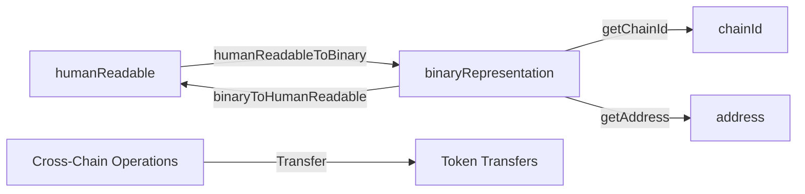

# @wonderland/interop

A TypeScript library for handling interoperable blockchain addresses and cross-chain operations across different networks.

This package combines two powerful functionalities:

1. **Interoperable Addresses**: Provides methods to convert between human-readable addresses and their binary string representation, following the [ERC-7930](https://ethereum-magicians.org/t/erc-7930-interoperable-addresses/23365) standard. For backward compatibility with existing smart contracts, the package includes utilities to extract individual components (chainId and address) from the binary representation.

2. **Cross-Chain Operations**: Enables seamless token transfers and swaps between different blockchain networks through a unified API, supporting various bridge protocols.



## Setup

1. Install dependencies running `pnpm install`

## Available Scripts

Available scripts that can be run using `pnpm`:

| Script        | Description                                             |
| ------------- | ------------------------------------------------------- |
| `build`       | Build library using tsc                                 |
| `check-types` | Check types issues using tsc                            |
| `clean`       | Remove `dist` folder                                    |
| `lint`        | Run ESLint to check for coding standards                |
| `lint:fix`    | Run linter and automatically fix code formatting issues |
| `format`      | Check code formatting and style using Prettier          |
| `format:fix`  | Run formatter and automatically fix issues              |
| `test`        | Run tests using vitest                                  |
| `test:cov`    | Run tests with coverage report                          |

## Usage

### Interoperable Addresses

```typescript
// Using the Provider
import { InteropAddressProvider } from '@wonderland/interop';

const humanReadableAddress = "alice.eth@eip155:1#ABCD1234"
const binaryAddress = InteropAddressProvider.humanReadableToBinary(humanReadableAddress)

// Or just importing the method
import { humanReadableToBinary } from '@wonderland/interop';
const binaryAddress = humanReadableToBinary(humanReadableAddress)
```

### Cross-Chain Operations

```typescript
import { createCrossChainProvider } from "@wonderland/interop";

// Create a provider for a specific protocol (e.g., Across)
const provider = createCrossChainProvider("across");

// Get a quote for a cross-chain transfer
const quote = await provider.getQuote("crossChainTransfer", {
    inputTokenAddress: "0x...",
    outputTokenAddress: "0x...",
    inputAmount: "1000000000000000000",
    inputChainId: 1,
    outputChainId: 137,
    sender: "0x...",
    recipient: "0x...",
});

// Simulate the transaction
const transactions = await provider.simulateOpen(quote.openParams);
```

## API

### Interoperable Addresses

#### [InteropAddressProvider](./src/providers/InteropAddressProvider.ts)

Available methods:

-   `humanReadableToBinary(humanReadableAddress: string)`
-   `binaryToHumanReadable(binaryAddress: Hex)`
-   `getChainId(binaryAddress: Hex)`
-   `getAddress(binaryAddress: Hex)`
-   `buildFromPayload(payload: InteropAddressFields)`
-   `computeChecksum(humanReadableAddress: string)`

### Cross-Chain Operations

#### [CrossChainProviderFactory](./src/services/crossChainProviderFactory.ts)

The factory provides a standardized way to create and manage cross-chain providers for different protocols.

Available methods:

-   `build<Protocol>(protocolName: Protocol, config?: Config, dependencies?: Dependencies)`: Creates a new provider instance for the specified protocol
-   `createCrossChainProvider<Protocol>(protocolName: Protocol, config?: Config, dependencies?: Dependencies)`: Helper function to create a provider instance

#### [CrossChainExecutor](./src/services/crossChainExecutor.ts)

The executor handles the execution of cross-chain operations, providing a unified interface for different protocols.

Available methods:

-   `execute(params: ExecutionParams)`: Executes a cross-chain operation
-   `getQuotes(params: QuoteParams)`: Gets a quote for a cross-chain operation

Supported protocols:

-   Across Protocol
-   More protocols coming soon...

## References

-   [ERC 7930: Interoperable Addresses](https://ethereum-magicians.org/t/erc-7930-interoperable-addresses/23365)
-   [Viem Documentation](https://viem.sh/) - Low-level Ethereum interface used for transaction handling
-   [Zod Documentation](https://zod.dev/) - TypeScript-first schema validation used for input validation
-   [Cross-Chain Interoperability Standards](https://ethereum.org/en/developers/docs/bridges/) - Overview of cross-chain bridge concepts
