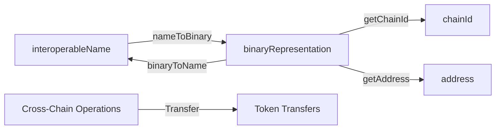

# @wonderland/interop

A TypeScript library for handling interoperable blockchain addresses and cross-chain operations across different networks.

This package combines two powerful functionalities:

1. **Interoperable Addresses**: Provides methods to convert between human-readable addresses and their binary string representation, following the [ERC-7930](https://ethereum-magicians.org/t/erc-7930-interoperable-addresses/23365) standard. For backward compatibility with existing smart contracts, the package includes utilities to extract individual components (chainId and address) from the binary representation.

2. **Cross-Chain Operations**: Enables seamless token transfers and swaps between different blockchain networks through a unified API, supporting various bridge protocols.


```mermaid
graph LR
    A[interoperableName]
    C[binaryRepresentation]
    D[chainId]
    E[address]
    F[Cross-Chain Operations]
    G[Token Transfers]

    A -->|nameToBinary| C
    C -->|binaryToName| A
    C -->|getChainId| D
    C -->|getAddress| E
    F -->|Transfer| G
```

## Setup

1. Install dependencies running `pnpm install`

## Available Scripts

Available scripts that can be run using `pnpm`:

| Script        | Description                                             |
| ------------- | ------------------------------------------------------- |
| `build`       | Build library using tsc                                 |
| `check-types` | Check types issues using tsc                            |
| `clean`       | Remove `dist` folder                                    |
| `lint`        | Run ESLint to check for coding standards                |
| `lint:fix`    | Run linter and automatically fix code formatting issues |
| `format`      | Check code formatting and style using Prettier          |
| `format:fix`  | Run formatter and automatically fix issues              |
| `test`        | Run tests using vitest                                  |
| `test:cov`    | Run tests with coverage report                          |

## Usage

### Interoperable Addresses

```typescript
// Using the Provider
// Or just importing the method
import { InteropAddressProvider, nameToBinary } from "@wonderland/interop";

const interoperableName = "alice.eth@eip155:1#ABCD1234";
const binaryAddress = await InteropAddressProvider.nameToBinary(interoperableName);

const binaryAddress = await nameToBinary(interoperableName);
```

### Cross-Chain Operations

```typescript
import { createCrossChainProvider } from "@wonderland/interop";
import { createPublicClient, createWalletClient, http } from "viem";
import { mainnet } from "viem/chains";

// Create a provider - Across works with no config (defaults to mainnet)
// Mainnet: https://app.across.to/api
// Testnet: https://testnet.across.to/api
const provider = createCrossChainProvider("across");

// Or with testnet config
const testnetProvider = createCrossChainProvider("across", { isTestnet: true });

// Get quotes using OIF format (addresses must be EIP-7930 binary format: 0x0001...)
// Use nameToBinary() from @wonderland/interop-addresses to convert human-readable addresses
const quotes = await provider.getQuotes({
    user: "0x0001000aa36a7114...", // binary format address
    intent: {
        intentType: "oif-swap",
        inputs: [
            {
                user: "0x0001000aa36a7114...",
                asset: "0x0001000aa36a7114...",
                amount: "1000000000000000000",
            },
        ],
        outputs: [
            {
                receiver: "0x0001000149d4114...",
                asset: "0x0001000149d4114...",
            },
        ],
        swapType: "exact-input",
    },
    supportedTypes: ["oif-escrow-v0"],
});

// Execute the selected quote
const selectedQuote = quotes[0];
if (selectedQuote?.preparedTransaction) {
    const walletClient = createWalletClient({
        chain: mainnet,
        transport: http("https://..."),
        account: "0x...",
    });
    const hash = await walletClient.sendTransaction(selectedQuote.preparedTransaction);
}
```

## API

### Interoperable Addresses

#### [InteropAddressProvider](./src/providers/InteropAddressProvider.ts)

Available methods:

-   `nameToBinary(interoperableName: string)` – Convert human-readable address to binary format
-   `binaryToName(binaryAddress: Hex)` – Convert binary address to human-readable format
-   `getChainId(address: string)` – Extract chain ID from an address
-   `getAddress(address: string)` – Extract the underlying address
-   `encodeAddress(payload: InteroperableAddress, opts?: { format: "hex" | "bytes" })` – Create binary address from components
-   `computeChecksum(interoperableName: string)` – Compute checksum for an address

### Cross-Chain Operations

#### [createCrossChainProvider](./src/services/crossChainProviderFactory.ts)

Creates a provider for the specified protocol:

```typescript
// Across - config optional (defaults to mainnet)
const acrossProvider = createCrossChainProvider("across");
const testnetProvider = createCrossChainProvider("across", { isTestnet: true });

// OIF - config required
const oifProvider = createCrossChainProvider("oif", {
    solverId: "my-solver",
    url: "https://solver.example.com",
});
```

#### CrossChainProvider

All providers implement these methods:

-   `.getProtocolName()` – Returns the protocol name
-   `.getProviderId()` – Returns the provider identifier
-   `.getQuotes(params)` – Fetch quotes for a cross-chain request (OIF GetQuoteRequest format)
-   `.submitSignedOrder(quote, signature)` – Submit a signed order (OIF providers only)
-   `.getTrackingConfig()` – Get configuration for intent tracking

#### [ProviderExecutor](./src/services/providerExecutor.ts)

For comparing quotes across multiple providers:

```typescript
import { createProviderExecutor } from "@wonderland/interop";

const executor = createProviderExecutor({
    providers: [acrossProvider, oifProvider],
});

const response = await executor.getQuotes({
    /* ... */
});
// response.quotes - sorted quotes from all providers
// response.errors - any provider errors
```

Supported protocols:

-   Across Protocol
-   OIF (Open Intents Framework)
-   More protocols coming soon...

## References

-   [ERC 7930: Interoperable Addresses](https://ethereum-magicians.org/t/erc-7930-interoperable-addresses/23365)
-   [Open Intents Framework](https://docs.openintents.xyz/) - OIF API specification
-   [Viem Documentation](https://viem.sh/) - Low-level Ethereum interface used for transaction handling
-   [Zod Documentation](https://zod.dev/) - TypeScript-first schema validation used for input validation
-   [Cross-Chain Interoperability Standards](https://ethereum.org/en/developers/docs/bridges/) - Overview of cross-chain bridge concepts
