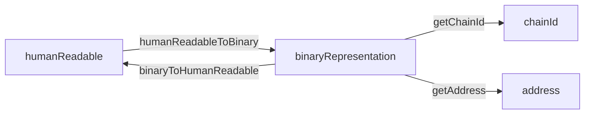

# @interop-sdk/addresses

A TypeScript library for handling interoperable blockchain addresses across different networks.

This package provides methods to convert between human-readable addresses and their binary string representation, both following the [ERC-7930](https://ethereum-magicians.org/t/erc-7930-interoperable-addresses/23365) standard. For backward compatibility with existing smart contracts, the package includes utilities to extract individual components (chainId and address) from the binary representation, allowing seamless integration with systems that haven't yet adopted the interop address format.



## Setup

1. Install dependencies running `pnpm install`

## Available Scripts

Available scripts that can be run using `pnpm`:

| Script        | Description                                             |
| ------------- | ------------------------------------------------------- |
| `build`       | Build library using tsc                                 |
| `check-types` | Check types issues using tsc                            |
| `clean`       | Remove `dist` folder                                    |
| `lint`        | Run ESLint to check for coding standards                |
| `lint:fix`    | Run linter and automatically fix code formatting issues |
| `format`      | Check code formatting and style using Prettier          |
| `format:fix`  | Run formatter and automatically fix issues              |
| `test`        | Run tests using vitest                                  |
| `test:cov`    | Run tests with coverage report                          |

## Usage

```typescript
// Using the Provider
import { InteropAddressProvider } from '@interop-sdk/addresses';

const humanReadableAddress = "alice.eth@eip155:1#ABCD1234"
const binaryAddress = InteropAddressProvider.humanReadableToBinary(humanReadableAddress)

// Or just importing the method
import { humanReadableAddress } from '@interop-sdk/addresses';
const humanReadableAddress = "alice.eth@eip155:1#ABCD1234"
const binaryAddress = humanReadableToBinary(humanReadableAddress)
```

## API

### [InteropAddressProvider](./src/providers/InteropAddressProvider.ts)

Available methods

-   `humanReadableToBinary(humanReadableAddress: string)`
-   `binaryToHumanReadable(binaryAddress: Hex)`
-   `getChainId(binaryAddress: Hex)`
-   `getAddress(binaryAddress: Hex)`
-   `buildFromPayload(payload: InteropAddressFields)`
-   `computeChecksum(humanReadableAddress: string)`

All methods are also exported as individual functions to allow maximum modularity and tree-shaking

## References

-   [ERC 7930: Interoperable Addresses - Fellowship of Ethereum Magicians](https://ethereum-magicians.org/t/erc-7930-interoperable-addresses/23365)
